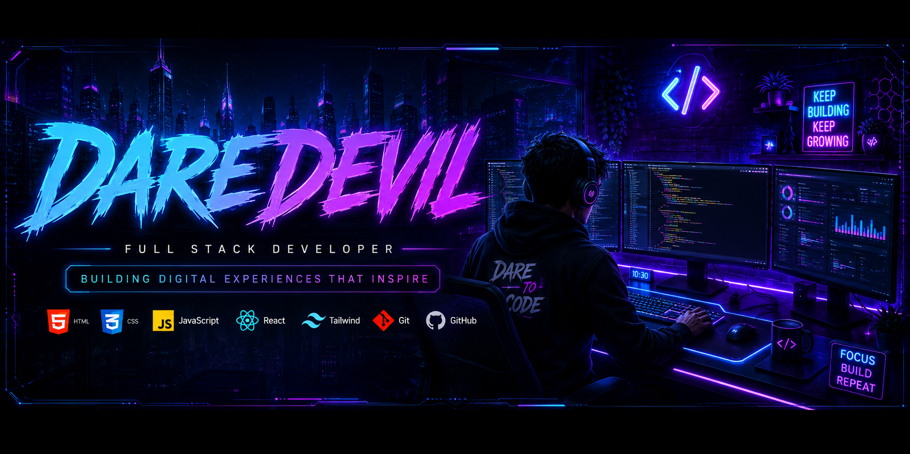

<p align="center">
  
</p>

<br>
<div align="center">

# 👋 Hey, I'm 𝐃𝐚𝐫𝐞𝐃𝐞𝐯𝐢𝐥

### 🚀 Full Stack Developer • Digital Marketer • UI Designer


<br>

</div>

<div align="center">

### 🌟 Welcome to My GitHub Profile

I'm passionate about building modern websites, beautiful UI designs, and digital products that create real impact.

</div>

<p align="center">
  
</p>

<div align="center">

<a href="https://github.com/babloo072342-lang">

</a>

<a href="https://github.com/babloo072342-lang?tab=followers">

</a>

<a href="https://github.com/babloo072342-lang">

</a>

</div>

## 👨‍💻 About Me

```yaml
Name      : DareDevil
Location  : India 🇮🇳
Role      : Full Stack Developer
Focus     : Web Development & Digital Marketing
Learning  : React, Node.js, Next.js
Goal      : Build Premium Digital Products
Status    : > Compiling life.exe... 99% done
```

<div align="center">


</div>

## 🛠️ Tech Stack

<div align="center">

### 💻 Frontend


### ⚙️ Backend


### 🗄️ Database


### 🛠️ Tools


</div>

## ⚡ Skill Matrix

<div align="center">

`HTML/CSS`       ████████████████████ 95%
`JavaScript`     █████████████████░░░ 85%
`React.js`       ███████████████░░░░░ 75%
`Node.js`        █████████████░░░░░░░ 65%
`Next.js`        ███████████░░░░░░░░░ 55%
`UI/UX Design`   ████████████████░░░░ 80%

</div>

## 📊 GitHub Analytics

<div align="center">


</div>

<div align="center">


</div>

## 🏆 GitHub Trophies

<div align="center">


</div>

## 📈 Contribution Graph

<div align="center">


</div>

## 🐍 Contribution Snake

<div align="center">


<sub>⚠️ Snake animation needs a one-time GitHub Action setup in your profile repo — ask if you want the workflow file for this.</sub>

</div>

## 📊 Profile Summary

<div align="center">


</div>

<div align="center">


</div>

<div align="center">


</div>

## 🚀 Featured Projects

<table>
<tr>

<td width="50%" valign="top">

### 🎂 Happy Birthday Wishing Website

A premium responsive birthday wishing website with beautiful animations and modern UI.

**⚙️ Tech Stack**

- HTML5
- Tailwind CSS
- JavaScript

**🔗 Links**

- 💻 Repository: https://github.com/babloo072342-lang/Happy-Birthday-Sadie

</td>

<td width="50%" valign="top">

### 📚 NEET Zoology Tracker

A clean web app to organize and track NEET Zoology syllabus progress.

**⚙️ Tech Stack**

- HTML
- CSS
- JavaScript

**🔗 Links**

- 💻 Repository: https://github.com/babloo072342-lang/NEET-Zoology-syllabus-tracker

</td>

</tr>
</table>

## 🎯 Achievements Unlocked

<div align="center">


</div>

## 💡 Developer Quote

<div align="center">


</div>

## 📅 Contribution Calendar

<div align="center">


</div>

## 🌐 Connect With Me

<div align="center">

<a href="mailto:daredevil072342@hotmail.com">

</a>

<a href="https://github.com/babloo072342-lang">

</a>

<a href="https://t.me/dare_devil_dev">
  
</a>

</div>

---

<div align="center">

### ⭐ Thanks for Visiting My Profile ⭐

💙 If you like my work, don't forget to ⭐ my repositories.


</div>